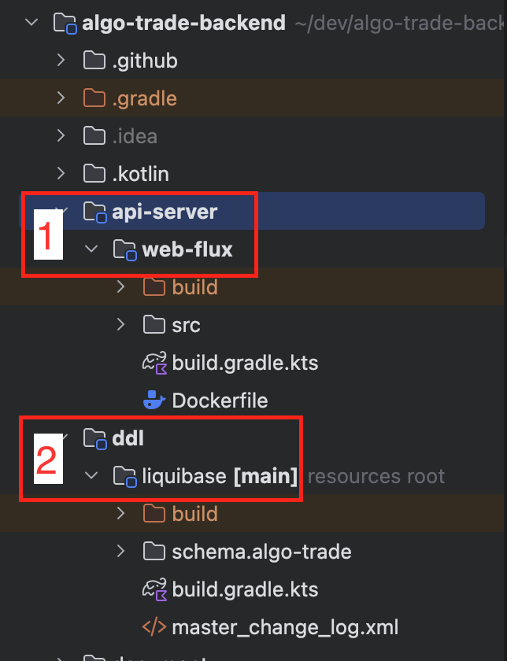

# 프로젝트 소개

## 이름

다중 금융상품 알고리즘 투자 알림 봇

## 설명

`가상화폐 거래소`와 `증권사`의 Open API를 사용해서 금융상품 가격을 조회하고, 지표 분석을 통해 주문 시점을 알려주는 프로그램이다.  
현재, 사용할 수 있는 거래소는 `ByBit(가상화폐 거래소)`과 `LS 투자증권(증권사)`이다.

## 요구사항

- Open API를 제공하는 다른 `가상화폐 거래소`와 `증권사`를 추가할 수 있어야 한다
- 라이브러리와 프레임워크를 쉽게 변경할 수 있어야 한다

## 목적

- TDD 훈련
- 핵사고날 아키텍처 실험
- Kotlin 과 SpringBoot WebFlux 학습

## 사용한 기술

- 프로그래밍 언어
    - [Kotlin](https://kotlinlang.org/)
- 프레임워크
    - [Spring Boot WebFlux](https://docs.spring.io/spring-framework/reference/web/webflux.html) (coroutine 기반): 웹 애플리케이션
      조립에 사용
    - [Spring Data R2DBC](https://spring.io/projects/spring-data-r2dbc): 영속성 데이터 접근에 사용
- 라이브러리
    - [OkHttp](https://square.github.io/okhttp/): http 통신, websocket 통신에 사용
    - [jackson](https://github.com/FasterXML/jackson): JSON 데이터 변환에 사용
    - [Jakarta Bean Validation](https://beanvalidation.org/): 입력 유효성 검사에 사용
    - [ta4j](https://github.com/ta4j/ta4j): 캔들 데이터 관리와 지표 생성에 사용
    - [Liquibase](https://www.liquibase.com/): RDB 스키마 관리를 위해 사용
    - [Testcontiners](https://testcontainers.com/): RDB 테스트에 사용

---

# 문제 해결

## TestContainer 와 Liquibase 를 사용한 DB 테스트 환경 구성

TestContainer 는 아래와 같이 `RdbTestContainer` 클래스에서 전역적(companion object)으로 설정한다.   
시스템 프로퍼티(`X_DBMS_NAME`)로 RDBMS 를 변경할 수 있다 (Postgresql, MySQL 지원)

https://github.com/newy2/algo-trade-backend/blob/dc1d97db173090985ef716a75364a795136a4e85/api-server/web-flux/src/test/kotlin/helpers/spring/RdbTestContainer.kt#L12-L38

DB 테스트 코드는 `BaseDataR2dbcTest` 클래스를 상속해서 작성한다.

https://github.com/newy2/algo-trade-backend/blob/dc1d97db173090985ef716a75364a795136a4e85/api-server/web-flux/src/test/kotlin/helpers/spring/BaseDataR2dbcTest.kt#L12-L32

https://github.com/newy2/algo-trade-backend/blob/dc1d97db173090985ef716a75364a795136a4e85/api-server/web-flux/src/test/kotlin/com/newy/algotrade/study/spring/r2dbc/AuditingTest.kt#L20-L116

## 운영 환경 별(local, test, production) RDBMS 의 Schema 생성 로직 추가

해당 프로젝트는 1개의 RDS 인스턴스에 `테스트 서버용 스키마(test_algo_trade)`와 `프로덕션 서버용 스키마(algo_trade)`를 분리해서 사용한다.    
아래와 같이 `com.nocwriter.runsql` gradle 플러그인을 사용하여, 운영 환경 별로 RDBMS 의 Schema 를 다르게 생성한다.

https://github.com/newy2/algo-trade-backend/blob/dc1d97db173090985ef716a75364a795136a4e85/ddl/liquibase/build.gradle.kts#L86-L100

https://github.com/newy2/algo-trade-backend/blob/dc1d97db173090985ef716a75364a795136a4e85/ddl/liquibase/build.gradle.kts#L36-L51

## Transactional 테스트

Spring Data R2DBC 에서는 테스트 메서드에서 `@Transactional`(테스트 종료 시, 롤벡 처리되는 헬퍼 애너테이션) 을 지원하지 않는다.

아래와 같이 `runTransactional` 핼퍼 메서드 제공하여, 테스트 코드 종료 시, 자동으로 롤백 처리를 하도록 한다.

https://github.com/newy2/algo-trade-backend/blob/dc1d97db173090985ef716a75364a795136a4e85/api-server/web-flux/src/test/kotlin/helpers/spring/BaseDataR2dbcTest.kt#L22-L32

아래와 같이 `runTransactional` 메서드를 사용한다.

https://github.com/newy2/algo-trade-backend/blob/dc1d97db173090985ef716a75364a795136a4e85/api-server/web-flux/src/test/kotlin/com/newy/algotrade/study/spring/r2dbc/AuditingTest.kt#L35-L53

## Transaction hook 테스트

해당 프로젝트에서는 구현 편의상 Service 컴포넌트에 `@Transactional` 애너테이션을 붙여서 사용한다.  
아래와 같이 DB 트렌젝션 커밋 이후에 실행해야 하는 로직(예: 이벤트 전송, 외부 API 호출 등)은 `useTransactionHook` 메서드를 사용해서 호출한다.

https://github.com/newy2/algo-trade-backend/blob/dc1d97db173090985ef716a75364a795136a4e85/api-server/web-flux/src/main/kotlin/com/newy/algotrade/notification_app/service/SendNotificationAppVerifyCodeCommandService.kt#L31-L43

`useTransactionHook` 사용 여부는 테스트 코드에서 `TransactionalOperator` 으로 부모 Transaction 을 열고,  
부모 Transaction 커밋 이후에 해당 로직이 호출됐는지 log 데이터에 기록 한다.  
그리고, log 데이터로 `useTransactionHook` 의 사용 여부를 확인한다.

https://github.com/newy2/algo-trade-backend/blob/dc1d97db173090985ef716a75364a795136a4e85/api-server/web-flux/src/test/kotlin/com/newy/algotrade/integration/notification_app/service/SendNotificationAppVerifyCodeCommandServiceTest.kt#L30-L57

`useTransactionHook` 구현 코드는 아래와 같다.  
Service 컴포넌트는 `유닛 테스트`에서도 사용하기 때문에 `forCurrentTransaction` 를 가져오는 로직에 대한 예외처리를 추가한다.

https://github.com/newy2/algo-trade-backend/blob/dc1d97db173090985ef716a75364a795136a4e85/api-server/web-flux/src/main/kotlin/com/newy/algotrade/spring/hook/TransactionHook.kt#L9-L34

## Spring Data R2DBC 에서 SSL 을 사용하여 RDS(PostgreSQL 16) 에 연결하기

RDS(PostgreSQL 16)은 기본적으로 SSL 모드가 켜져있다.  
Spring Data R2DBC 에서 SSL 을 사용하여 RDS 에 연결하기 위해서, AWS 에서 제공하는 공개키와 아래와 같은 URL 형식으로 설정한다.

```
# application.properties 파일 (RDS 접속 URL 설정하는 부분)
spring.r2dbc.url=r2dbc:postgresql://${X_DB_URL}?sslmode=require&sslrootcert=classpath:aws/rds/ssl/ap-northeast-2-bundle.pem
```

참고 파일:

- api-server/web-flux/src/main/resources/application.properties
- api-server/web-flux/src/main/resources/aws/rds/ssl/ap-northeast-2buldle.pem

참고 URL:

- https://stackoverflow.com/questions/76899023/rds-while-connection-error-no-pg-hba-conf-entry-for-host#answer-78269214
- https://docs.aws.amazon.com/AmazonRDS/latest/UserGuide/PostgreSQL.Concepts.General.SSL.html

## MySQL CHAR(1) 컬럼 타입이 Kotlin 의 Char 타입으로 매핑되지 않는 현상

PostgreSQL 의 CHAR(1) 타입은 Kotlin 의 Char 타입으로 매핑할 수 있지만,  
MySQL 의 CHAR(1) 타입은 Kotlin 의 Char 타입으로 매핑할 수 없다. (`io.asyncer:r2dbc-mysql` 드라이버 사용)

해당 프로젝트에서는 DBMS의 CHAR(1) 타입을 Kotlin 의 String 타입으로 매핑해서 사용한다.

매핑 에러 테스트 코드는 아래와 같다.

```kotlin
@Repository
interface UserRepositoryForCharTypeTest : CoroutineCrudRepository<UserR2dbcEntityForCharTypeTest, Long>

@Table("users")
data class UserR2dbcEntityForCharTypeTest(
    @Id val id: Long = 0,
    val email: String,
    val autoTradeYn: Char = 'N'
)

class MySqlDataTypeTest(
    @Autowired private val charTypeRepository: UserRepositoryForCharTypeTest,
) : BaseDataR2dbcTest() {
    @Test
    fun `MySql 은 CHAR(1) 타입을 Kotlin 의 Char 타입으로 변환하지 못한다`() = runTransactional {
        val dbName = getSystemProperty("X_DBMS_NAME")
        when (dbName) {
            "postgresql" -> {
                assertDoesNotThrow {
                    charTypeRepository.save(
                        UserR2dbcEntityForCharTypeTest(
                            email = "test@test.com",
                        )
                    )
                }
            }
            "mysql" -> {
                val error = assertThrows<java.lang.IllegalArgumentException> {
                    charTypeRepository.save(
                        UserR2dbcEntityForCharTypeTest(
                            email = "test@test.com",
                        )
                    )
                }
                assertEquals("Cannot encode class java.lang.Character", error.message)
            }
            else -> {
                fail("지원하지 않는 DB 입니다")
            }
        }
    }
}
```

참고 파일:
- 

## MySQL DATETIME 컬럼 타입을 LocalDate 타입으로 매핑 시, Fractional Seconds(분수 초)가 나오지 않는 현상

PostgreSQL 의 TIMESTAMPE 타입을 LocalDate 타입으로 매핑하면 분수초까지 나오지만,  
MySQL 의 DATETIME 타입을 LocalDate 타입으로 매핑하면 분수초가 0으로 나오는 현상이 발생했다. (초 단위로 반올림 됨)

Liquibase 에서 전역 property 로 날짜 타입과 기본값을 선언하고, 해당 property 를 사용해서 DBMS 에 맞는 테이블을 생성한다.

전역 property 를 선언하는 코드는 아래와 같다.

```xml
<?xml version="1.0" encoding="UTF-8"?>
<databaseChangeLog
        xmlns:xsi="http://www.w3.org/2001/XMLSchema-instance"
        xmlns="http://www.liquibase.org/xml/ns/dbchangelog"
        xsi:schemaLocation="http://www.liquibase.org/xml/ns/dbchangelog
        http://www.liquibase.org/xml/ns/dbchangelog/dbchangelog-latest.xsd"
>
    <!-- Liquibase 전역 property 설정하는 로직 -->
    <property name="dateTimeType" value="DATETIME" global="true" dbms="postgresql"/>
    <property name="defaultDateTimeValue" value="NOW()" global="true" dbms="postgresql"/>
    <property name="dateTimeType" value="DATETIME(6)" global="true" dbms="mysql"/>
    <property name="defaultDateTimeValue" value="NOW(6)" global="true" dbms="mysql"/>

    <includeAll path="schema/algo-trade" context="algo_trade"/>
</databaseChangeLog>
```

전역 property 를 사용하는 코드는 아래와 같다.

```xml
<?xml version="1.0" encoding="UTF-8"?>
<databaseChangeLog
        xmlns:xsi="http://www.w3.org/2001/XMLSchema-instance"
        xmlns="http://www.liquibase.org/xml/ns/dbchangelog"
        xsi:schemaLocation="http://www.liquibase.org/xml/ns/dbchangelog
        http://www.liquibase.org/xml/ns/dbchangelog/dbchangelog-latest.xsd"
>
    <property name="currentTable" value="market" global="false"/>
    <property name="currentTableComment" value="거래소" global="false"/>

    <changeSet author="newy" id="1">
        <createTable tableName="${currentTable}" remarks="${currentTableComment}">
            <!-- 전역 property 사용하는 로직 -->
            <column name="created_at" type="${dateTimeType}" remarks="생성일시" defaultValueDate="${defaultDateTimeValue}">
                <constraints nullable="false"/>
            </column>
            <column name="updated_at" type="${dateTimeType}" remarks="변경일시" defaultValueDate="${defaultDateTimeValue}">
                <constraints nullable="false"/>
            </column>
        </createTable>
    </changeSet>
</databaseChangeLog>
```

참고 URL:

- https://dev.mysql.com/doc/refman/8.4/en/fractional-seconds.html

---

# 용어 정리

해당 문서에서는 아래와 같이 `Bold`처리한 용어를 사용한다

  
이미지 출처: https://tech.kakaobank.com/posts/2311-hexagonal-architecture-in-messaging-hub/

- `인커밍 어댑터` (Driving Adapter)
    - 유스케이스를 호출하는 컴포넌트
    - 외부 요청을 받아서 유스케이스에게 작업을 위임하고, 작업 결과 값을 요청자에게 전달한다
- `아웃고잉 어댑터` (Driven Adapter)
    - 유스케이스가 호출하는 컴포넌트
    - 유스케이스 작업에 필요한 데이터를 조회하거나, 유스케이스가 요청하는 데이터 저장한다
    - 주로, DB 통신, 외부 API 호출같이 외부 프로세스와 통신하는 로직을 구현한다
- `애플리케이션 코어 계층` (Application Core)
    - `유스케이스` (Use Case)
        - 계층형 아키텍처에서 Service로 불리는 컴포넌트
        - 인커밍/아웃고잉 어댑터의 데이터를 조합해서, 도메인 객체에 비즈니스 로직 처리를 요청한다
        - 종종, 도메인 객체가 필요하지 않을 수도 있다
    - `도메인 엔티티` (Entity)
        - 유스케이스가 요청한 비즈니스 로직을 처리한다
    - `인커밍 포트` (Input Port)
    - `아웃고잉 포트` (Output Port)
        - 유스케이스가 인커밍/아웃고잉 어댑터와 통신하기 위해 사용하는 Interface 이다

---

# 프로젝트 모듈 설명



1. `api-server/core/coroutine-based-application`
    - 비동기 로직에 특화된 비즈니스 로직을 구현한 모듈이다
    - Spring WebFlux, Ktor, Android 앱과 같이 코루틴을 지원하는 프로젝트에서 사용하기 위해 분리했다
    - 유스케이스, 코루틴 기반 라이브러리(HTTP 통신, 이벤트 버스 등), 메모리 저장소 등의 구현을 담당한다
2. `api-server/core/domain`
    - 동기/비동기 로직에 공통된 비즈니스 로직을 구현한 모듈이다
    - Spring WebMVC 같은 동기 기반 프로젝트에서도 사용하기 위해 분리했다
    - 주가 데이터를 사용한 지표 계산, 주문 진입/진출 알고리즘 계산, JSON 변환 등의 로직을 담당한다
3. `api-server/webflux`
    - SpringBoot WebFlux 를 사용한 웹 애플리케이션 모듈이다
    - 웹 애플리케이션 조립과 영속성 어댑터 구현을 담당한다
4. `ddl/liquibase`
    - 개발/테스트/운영용 RDB 스키마를 관리하기 위한 모듈이다
    - [Liquibase](https://www.liquibase.com/) 를 사용해서 구현했고, 환경 변수(X_DBMS_NAME)로 `postgresql`과 `mysql`을 선택할 수 있게 구현했다

# 테스트 패키지 설명


- `com.newy.algotrade.integration`
    - 외부 API 통신, RDB 접근 등 외부 프로세스와 통신하는 테스트 코드를 작성한다
- `com.newy.algotrade.study`
    - 프로그래밍 언어와 라이브러리의 사용법에 대한 테스트 코드를 작성한다
    - 프로젝트에서 사용해야 하는 문법과 라이브러리 사용법을 학습한다
    - 프로그래밍 언어와 라이브러리의 버전 업그레이드를 대비한다
- `com.newy.algotrade.unit`
    - 외부 프로세스와 통신이 필요 없는 유닛 테스트 코드를 작성한다
- `helpers`
    - 테스트 프로젝트에서만 사용하는 공통 코드를 작성한다

## 테스트 패키지를 분리한 이유

상황에 맞는 테스트 실행 명령어를 호출하기 위해서, 위와 같이 테스트 패키지 구조를 분리했다.

```bash
# 유닛 테스트 실행 명령어
./gradlew test --tests "com.newy.algotrade.unit.*" --tests "com.newy.algotrade.study.*"

# DB 테스트 실행 명령어
./gradlew api-server:web-flux:test --tests "com.newy.algotrade.integration.*"

# 전체 테스트 실행 명령어
./gradlew test
```

# coroutine-based-application, webflux 모듈 패키지 설명


- `common`: 모듈에서 공통으로 사용하는 코드 구현
- `config`: 스프링 config 코드 선언 (webflux 모듈에서 사용)
- `도메인 이름 패키지` (ex: product_price)
    - `adapter.in`: 인커밍 어댑터 구현
    - `adapter.in.web`: 웹 어댑터 구현
    - `adapter.in.web.model`: 웹 입/출력 모델 구현
    - `adapter.in.internal_system`: 내부 시스템 입력 어댑터 구현 (내부 이벤트 수신, 콜벡 port 구현 로직 등)
    - `adapter.out`: 아웃고잉 어댑터 구현
    - `adapter.out.persistence`: 영속성 어댑터 구현
    - `adapter.out.persistence.repository`: Spring Data R2dbcRepository 관련 로직 구현
    - `adapter.out.volatile_storage`: 메모리 캐시 어댑터 구현
    - `adapter.out.event_publisher`: 이벤트 발행 어댑터 구현
    - `adapter.out.external_system`: 외부 시스템 통신 어댑터 구현
    - `port.in`: 인커밍 포트 선언
    - `port.in.model`: 인커밍 포트 입력 모델 구현(입력 데이터 유효성 검증 담당)
    - `port.out`: 아웃고잉 포트 선언
    - `service`: 유스케이스 구현

---

# 코딩 컨벤션

## 인커밍 포트

### 인터페이스 이름

데이터 변경하는 인커밍 포트는 접미사 `UseCase`를 사용하고, 그 외는 접미사 `Query`를 사용한다.

```kotlin
// 쓰기 전용 인커밍 포트
interface CandlesUseCase :
    SetCandlesUseCase,
    AddCandlesUseCase,
    RemoveCandlesUseCase

// 읽기 전용 인커밍 포트
interface CandlesQuery :
    GetCandlesQuery
```

### 인커밍 포트 모델 이름

접미사 `Command`를 사용한다. SelfValidating을 상속받아서, 입력 데이터 유횻값을 검증한다.

```kotlin
data class SetMarketAccountCommand(...) : SelfValidating() {
    init {
        validate()
    }
}
```

## 유스케이스

### 클래스 이름

- `coroutine-based-application 모듈`: 인커밍 포트 이름에 접미사 `Service`를 사용한다. (인커밍 포트 이름이 `UseCase` 인 경우, 유스케이스 이름은 `Command` 로
  변경해서 사용한다)

    ```kotlin
    // UseCase 인커밍 포트를 구현하는 경우 (UseCase를 Command로 변경해서 사용한다)
    class MarketAccountCommandService : MarketAccountUseCase {
        ...
    }
  
    // Query 인커밍 포트를 구현하는 경우
    open class StrategyQueryService : StrategyQuery {
        ...
    }
    ```

- `web-flux 모듈`: 접두사 `Spring` 과 유스케이스 이름을 사용한다.

    ```kotlin
    @Service
    @Transactional
    open class SpringMarketAccountCommandService(...) : MarketAccountCommandService(marketAccountPort) {
        ...
    }
    ```

## 아웃고잉 포트

### 인터페이스 이름

접미사 `Port`를 사용한다. `개별 Port Interface`의 이름은 아래에서 설명하는 [메서드 이름](#메서드-이름)를 참고해서 짓는다.

```kotlin
interface MarketAccountPort :
    ExistsMarketAccountPort,
    FindMarketServerPort,
    SaveMarketAccountPort
```

### 메서드 이름

메서드 이름은 아웃고잉 어댑터에서 사용하는 라이브러리의 메서드 이름과 비슷하게 짓는다.  
영속성 아웃고잉 포트는 `findXxx`, `deleteXxx`, `saveXxx`, `existsXxx` 같은 이름을 사용하고,  
외부 시스템 아웃고잉 포트(HTTP API 통신)는 `fetchXxx` 같은 이름을 사용한다.

```kotlin
// 영속성 아웃고잉 포트
fun interface ExistsMarketAccountPort {
    suspend fun existsMarketAccount(domainEntity: MarketAccount): Boolean
}

// 외부 시스템 아웃고잉 포트
fun interface FetchProductPricesPort {
    suspend fun fetchProductPrices(param: GetProductPriceHttpParam): List<ProductPrice>
}
```

#### 메서드 이름 짓는 규칙을 정한 이유

`인커밍 포트의 메서드 이름`과 `아웃고잉 포트의 메서드 이름`이 같아지는 현상을 방지하기 위해서,  
아웃고잉 포트의 메서드 이름을 짓는 패턴을 변경했다.

```kotlin
// AS-IS (인커밍 포트와 아웃고잉 포트의 메서드 이름이 같다)
open class StrategyQueryService(
    private val strategyPort: HasStrategyPort
) : StrategyQuery {
    // 인커밍 포트의 메서드 이름이 'hasStrategy' 이고 
    override suspend fun hasStrategy(className: String): Boolean {
        // 아웃고잉 포트의 메서드 이름도 'hasStrategy' 이다.
        return strategyPort.hasStrategy(className)
    }

}

// TO-BE (인커밍 포트와 아웃고잉 포트의 메서드 이름이 다르다)
open class StrategyQueryService(
    private val strategyPort: ExistsStrategyPort
) : StrategyQuery {
    // 인커밍 포트의 메서드 이름이 'hasStrategy' 이고
    override suspend fun hasStrategy(className: String): Boolean {
        // 아웃고잉 포트의 메서드 이름은 'existsStrategy' 이다.
        return strategyPort.existsStrategy(className)
    }

}
```

## 아웃고잉 어댑터

### 클래스 이름

- 영속성 어댑터: 접미사 `PersistenceAdapter` 를 사용한다.
- 이벤트 발행 어댑터: 접미사 `EventPublisher` 를 사용한다.
- 인메모리 저장소 어댑터: 접미사 `StoreAdapter` 를 사용한다.

```kotlin
// 영속성 어댑터
class MarketAccountPersistenceAdapter : MarketAccountPort {
    ...
}

// 이벤트 발행 어댑터
open class OnReceivePollingPriceEventPublisher : OnReceivePollingPricePort {
    ...
}

// 인메모리 저장소 어댑터
class InMemoryCandlesStoreAdapter : CandlesPort {
    ...
}
```

---

# 프로젝트 실행 명령어

## 테스트 실행 명령어

### 유닛 테스트 실행

```bash
./gradlew test --tests "com.newy.algotrade.unit.*" --tests "com.newy.algotrade.study.*"
```

### DB 테스트 실행

```bash
# DB 테스트 실행 템플릿
./gradlew api-server:web-flux:test --tests "com.newy.algotrade.integration.*" -DX_DBMS_NAME={postgresql | mysql}

# 예시: PostgreSQL 기반 DB 테스트 실행
./gradlew api-server:web-flux:test --tests "com.newy.algotrade.integration.*" -DX_DBMS_NAME=postgresql

# 예시: MySQL 기반 DB 테스트 실행
./gradlew api-server:web-flux:test --tests "com.newy.algotrade.integration.*" -DX_DBMS_NAME=mysql
```

### 통합 테스트 실행 (ByBit, LS증권의 Open API Key 를 발급 받지 않은 경우 )

```bash
```bash
# 통합 실행 템플릿
./gradlew test -DX_DBMS_NAME={postgresql | mysql}

# 예시: PostgreSQL 기반 통합 테스트 실행
./gradlew test -DX_DBMS_NAME=postgresql

# 예시: MySQL 기반 통합 테스트 실행
./gradlew test -DX_DBMS_NAME=mysql
```

### 통합 테스트 실행 (ByBit, LS증권의 Open API Key 를 발급 받은 경우 )

```bash
# 통합 실행 템플릿
./gradlew test \
-DX_DBMS_NAME={postgresql | mysql} \
-DX_BY_BIT_API_KEY={ByBit API SECRET} \
-DX_BY_BIT_API_SECRET={ByBit API SECRET} \
-DX_LS_SEC_API_KEY={LS 증권 API KEY} \
-DX_LS_SEC_API_SECRET={LS 증권 API SECRET}

# 예시: PostgreSQL 기반 통합 테스트 실행
./gradlew test \
-DX_DBMS_NAME=postgresql \
-DX_BY_BIT_API_KEY={ByBit API SECRET} \
-DX_BY_BIT_API_SECRET={ByBit API SECRET} \
-DX_LS_SEC_API_KEY={LS 증권 API KEY} \
-DX_LS_SEC_API_SECRET={LS 증권 API SECRET}

# 예시: MySQL 기반 통합 테스트 실행
./gradlew test \
-DX_DBMS_NAME=mysql \
-DX_BY_BIT_API_KEY={ByBit API SECRET} \
-DX_BY_BIT_API_SECRET={ByBit API SECRET} \
-DX_LS_SEC_API_KEY={LS 증권 API KEY} \
-DX_LS_SEC_API_SECRET={LS 증권 API SECRET}
```

## RDB 스키마 생성, 삭제 명령어

### 스키마 생성

```bash
# DB 스키마 생성 커맨드 템플릿
./gradlew :ddl:liquibase:update \
-DX_DBMS_NAME={postgresql | mysql} \
-DX_MYSQL_JDBC_URL={MySQL JDBC URL} \
-DX_MYSQL_USERNAME={MySQL username} \
-DX_MYSQL_PASSWORD={MySQL password} \
-DX_POSTGRESQL_JDBC_URL={PostgreSQL JDBC URL} \
-DX_POSTGRESQL_USERNAME={PostgreSQL username} \
-DX_POSTGRESQL_PASSWORD={PostgreSQL password} \
-DX_LS_SEC_API_KEY={LS 증권 API KEY} \
-DX_LS_SEC_API_SECRET={LS 증권 API SECRET}

# 예시: PostgreSQL DB 스키마 생성
./gradlew :ddl:liquibase:update \
-DX_DBMS_NAME=postgresql \
-DX_POSTGRESQL_JDBC_URL=jdbc:postgresql://localhost:5432/ \
-DX_POSTGRESQL_PASSWORD=root \
-DX_POSTGRESQL_USERNAME=postgres \
-DX_LS_SEC_API_KEY={LS 증권 API KEY} \
-DX_LS_SEC_API_SECRET={LS 증권 API SECRET}

# 예시: MySQL DB 스키마 생성
./gradlew :ddl:liquibase:update \
-DX_DBMS_NAME=mysql \
-DX_MYSQL_JDBC_URL=jdbc:mysql://localhost:3306 \
-DX_MYSQL_PASSWORD=root \
-DX_MYSQL_USERNAME=root \
-DX_LS_SEC_API_KEY={LS 증권 API KEY} \
-DX_LS_SEC_API_SECRET={LS 증권 API SECRET}
```

### 스키마 삭제

```bash
# DB 스키마 생성 커맨드 템플릿
./gradlew :ddl:liquibase:dropAll \
-DX_DBMS_NAME={postgresql | mysql} \
-DX_MYSQL_JDBC_URL={MySQL JDBC URL} \
-DX_MYSQL_USERNAME={MySQL username} \
-DX_MYSQL_PASSWORD={MySQL password} \
-DX_POSTGRESQL_JDBC_URL={PostgreSQL JDBC URL} \
-DX_POSTGRESQL_USERNAME={PostgreSQL username} \
-DX_POSTGRESQL_PASSWORD={PostgreSQL password}

# 예시: PostgreSQL DB 스키마 삭제
./gradlew :ddl:liquibase:dropAll \
-DX_DBMS_NAME=postgresql \
-DX_POSTGRESQL_JDBC_URL=jdbc:postgresql://localhost:5432/ \
-DX_POSTGRESQL_PASSWORD=root \
-DX_POSTGRESQL_USERNAME=postgres

# 예시: MySQL DB 스키마 삭제
./gradlew :ddl:liquibase:dropAll \
-DX_DBMS_NAME=mysql \
-DX_MYSQL_JDBC_URL=jdbc:mysql://localhost:3306 \
-DX_MYSQL_PASSWORD=root \
-DX_MYSQL_USERNAME=root
```

---

# 개발환경 설정 & 실행 방법

```
작성 예정
```

---

# 다이어그램

## ERD


## 클래스 다이어그램

### 캔들 차트 지표 계산 도메인


### 그 외 클래스 다이어그램

```kotlin
작성 예정
```